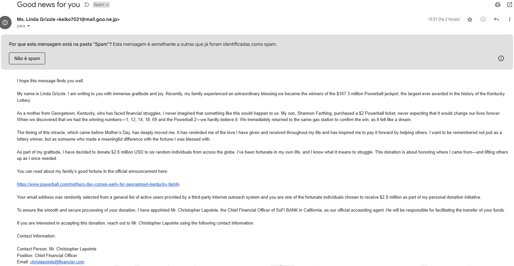

# Situação de Aprendizado

## Soluções para ameaças cibernéticas

### Phishing

Phishing é um tipo de crime cibernético onde os criminosos tentam obter informações confidenciais, como senhas e dados de cartões de crédito, fingindo ser uma entidade confiável. 

Estes ataques ocorrem por meio de e-mails, mensagens de texto ou sites falsos, induzindo as pessoas a compartilharem dados sensíveis, como nome, endereço, documentos, senhas, contas bancárias, etc.

Alguns exemplos de phishing:
* **Phishing por e-mail:** Golpe por email
* **Man-in-the-middle:** Interceptação de dados
* **Pharming:** Redirecionamento malicioso

#### Exemplo de phishing por e-mail

---

### Ransomware
Ransomware é um tipo de malware que sequestra o computador da vítima, bloqueando o acesso a arquivos ou dispositivos e exigindo um pagamento, geralmente em criptomoedas, para restaurar o acesso. 

Este software malicioso é utilizado para extorsão, criptografando dados digitais e mantendo-os como reféns até que um resgate seja pago. Os ataques de ransomware são uma das formas mais comuns de cibercrime e podem custar milhões de dólares às organizações afetadas.

#### Exemplo de Ransomware

## Soluções para vulnerabilidades

### Senhas fracas
Senhas fracas, como “123456” ou “admin”, são um convite aberto para invasores. Fáceis de adivinhar, elas comprometem a segurança de contas e expõem dados pessoais a riscos desnecessários. Para garantir proteção real, é fundamental criar senhas fortes e únicas, combinando letras, números e símbolos. Em um mundo digital cada vez mais vulnerável, uma boa senha é a primeira linha de defesa.

As senhas melhores, mais poderosas e mais fortes são longas, difíceis de adivinhar e exclusivas. Isso significa usar no mínimo 15 caracteres, palavras ou frases difíceis de adivinhar e difíceis de serem ligadas a você e nunca reutilizar senhas em outras contas. Boas ideias de senha satisfazem todos esses três requisitos.
#### Exemplos de senhas fortes:
* Zdhkqjbu83
* 74Xmbgdapw
* Bmukwes3901!
* lw;62v74y

### Software desatualizado

Outdated Software, ou software desatualizado, é um termo utilizado para descrever programas de computador que não foram atualizados para versões mais recentes. Esses softwares podem apresentar vulnerabilidades de segurança, falta de recursos e incompatibilidade com sistemas operacionais modernos. 

Manter softwares atualizados é fundamental para garantir segurança, desempenho e compatibilidade. Atualizações corrigem falhas, fecham brechas exploradas por cibercriminosos e trazem melhorias que otimizam o uso. Adiar esses updates pode deixar o sistema vulnerável a ataques e prejudicar sua estabilidade. Em resumo, atualizar não é apenas uma questão de novidade — é uma medida essencial de proteção e eficiência.

## Soluções para engenharia social

### Pretexting
Pretexting é o uso de uma história fabricada, ou pretexto, para ganhar a confiança de uma vítima e enganá-la ou manipulá-la para compartilhar informações confidenciais, baixar malware, enviar dinheiro para criminosos ou prejudicar a si mesma ou à organização para a qual trabalha.

#### Exemplos de pretexting
* Golpes de atualização de conta
* Golpes de comprometimento de e-mail comercial
* Golpes de criptomoedas
* Golpes de faturas
* Golpes do IR e do governo
* Golpes de ofertas de emprego
* Golpes sociais
* Golpes de scareware

  
### Baiting
Nesses tipos de ataques, um criminoso engana uma vítima para que ela baixe malware, seduzindo-a com uma isca atraente, mas comprometida. A isca pode ser física, como um pen drive carregado com código malicioso e deixado visivelmente em um local público. Ou a isca pode ser digital, como publicidade de downloads gratuitos de filmes que acabam sendo malware.

## Intervenções e Respostas a Incidentes
### Violação de dados
Uma violação de dados é qualquer incidente de segurança em que partes não autorizadas acessam informações sensíveis ou confidenciais, incluindo dados pessoais (como números de seguridade social, números de contas bancárias, dados de saúde) e dados corporativos (registros de clientes, propriedade intelectual, informações financeiras).  

As violações de dados podem ser causados por:
* **Erros inocentes:** como um funcionário enviar informações confidenciais para a pessoa errada por e-mail.
* **Agentes internos maliciosos:** como funcionários demitidos ou insatisfeitos que desejam prejudicar a empresa e funcionários gananciosos que querem lucrar com os dados da empresa.
* **Hackers:** agentes externos maliciosos que cometem crimes cibernéticos intencionais para roubar dados. Hackers podem agir sozinhos ou como parte de um grupo organizado.

